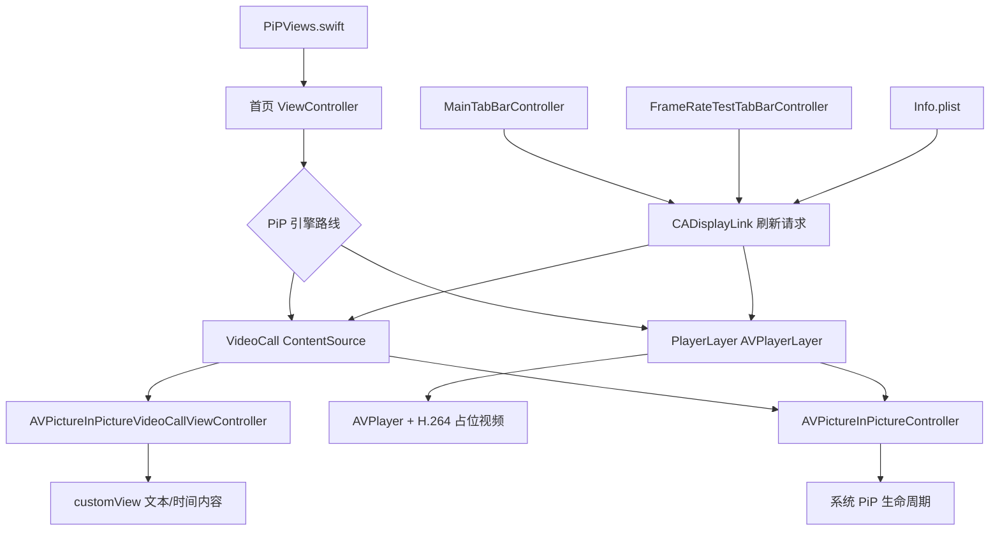

# GlobalRefresh-PiP v1.0.9

## 120Hz PiP 集成 PRD

**文档状态**：开发者集成参考稿
**基线版本**：`v1.0.9`（GitHub tag，不以 `master` 最新代码或后续 beta 实验代码为准）
**整理日期**：2026-08-17
**适用对象**：希望在自己的 iOS 悬浮窗 / PiP App 中复用本项目能力的开发者

> 本文只描述 1.0.9 正式版对外的两条方案。源码中的其他实验或兼容分支不属于普通用户的两套正式方案，也不纳入本集成 PRD。

## 1. 资料、署名与基线

- 项目仓库：[Yoroin/GlobalRefresh-PiP](https://github.com/Yoroin/GlobalRefresh-PiP)
- 正式版源码标签：[v1.0.9](https://github.com/Yoroin/GlobalRefresh-PiP/tree/v1.0.9)
- 正式版发布页：[v1.0.9 Release](https://github.com/Yoroin/GlobalRefresh-PiP/releases/tag/v1.0.9)
- 原始 PiP 示例：[CaiWanFeng/PiP](https://github.com/CaiWanFeng/PiP)
- 本地当前工作副本：`/Users/h/Downloads/PiP_副本`

本项目是在 CaiWanFeng/PiP 基础上继续开发的修改版。集成、修改、分发或发布时，保留 CaiWanFeng、Yoroin 及两个项目地址，具体以 [NOTICE](https://github.com/Yoroin/GlobalRefresh-PiP/blob/v1.0.9/NOTICE) 和 README 署名说明为准。

## 2. 产品目标与边界

### 2.1 目标

**本项目的核心能力，是让普通 PiP 悬浮窗获得辅助解锁 iOS 系统全局 120Hz 的能力。**

这就是用户长期使用的“**卡 120**”功能：通过一个持续存在、可以吸附到屏幕侧边的普通悬浮窗，让部分原本锁定 80Hz 的 App 在 ProMotion 设备上恢复更高的刷新率表现，最高可达到 120Hz。它不是单纯的悬浮窗显示工具，也不只是后台保活工具，而是利用系统 PiP 内容管线影响刷新调度的高刷辅助方案。

从产品和技术定位上看，本项目提供的是一套**悬浮窗 PiP 底层实现方案**。第三方开发者不需要照搬本项目的首页、按钮、文字或悬浮窗 UI，而是将底层 PiP 内容源、刷新请求、生命周期管理和高度同步逻辑接入自己原有的悬浮窗 App。原有的悬浮窗界面、交互和业务功能可以继续保留。

项目同时解决了传统悬浮时钟类方案的几个实际痛点：

- 普通文本悬浮窗即可参与全局高刷解锁，不要求用户长期显示一个明显的时钟窗口。
- `VideoCall` 正式方案支持将悬浮窗高度调节至 `0.1pt`，实现视觉上的完全隐藏。
- 支持吸附到屏幕侧边，减少悬浮窗对日常使用的干扰。
- 基于系统 PiP 提供后台保活能力，并保留运行状态和诊断信息。
- 不依赖广告展示，源码和实现路径公开，方便开发者研究、集成和二次开发。
- 针对锁 60Hz 的游戏或弹幕场景提供 `PlayerLayer` 方案，减少高刷与 App 自身刷新策略不同步造成的卡顿。

相比常见的悬浮时钟类工具，本项目重点提供“**可解锁高刷、可完全隐藏、可后台保活、无广告**”的底层能力。开发者可以将其中的 PiP 内容源、刷新请求和高度同步逻辑集成到自己的悬浮窗 App 中，而不是必须重新制作一个完整的悬浮窗应用。

最终刷新率仍由设备硬件、iOS 版本、前台 App 策略、PiP 状态和系统资源共同决定；“卡 120”是实测意义上的辅助效果，不是公开 API 授予的永久系统权限。

### 2.2 推荐集成方式

**一般应优先采用方案一 `VideoCall` 作为第三方悬浮窗 App 的默认底层。**

- 第三方 App 继续使用自己的悬浮窗 UI 和交互。
- 将原有悬浮窗内容挂载到 `AVPictureInPictureVideoCallViewController` 的内容容器中。
- 使用 `ContentSource(activeVideoCallSourceView:contentViewController:)` 创建 PiP 内容源。
- 同步维护 PiP 容器的 `preferredContentSize`、source view 宽高约束和内部内容布局。
- 通过主界面的 `CADisplayLink` / `CAFrameRateRange` 刷新请求辅助触发高刷表现。
- 当用户将悬浮窗吸附到侧边后，可将 VideoCall 内容尺寸调节至 `0.1pt`，实现视觉隐藏。

方案二 `PlayerLayer` 只建议作为针对锁 60Hz 游戏、弹幕不同步等特殊场景的可选底层，不应默认替换方案一。它的最低高度、素材生成、播放器生命周期和视觉隐藏能力都更复杂，第三方集成时应作为独立实验入口保留。

因此，本项目对外提供的核心价值不是“复制一个悬浮窗 App”，而是：**让已有悬浮窗 App 在保留自身 UI 和功能的前提下，接入一套可复用的高刷 PiP 底层方案。**

### 2.3 必须写进产品说明的边界

- 不能把 60Hz 硬件变成 120Hz。
- 不能保证任何 App 都能达到 120Hz。
- “解锁 120Hz”是实测意义上的辅助效果，不是公开 API 提供的强制系统权限。
- PiP 保活不是永久后台权限，可能受到内存压力、系统策略、其他 PiP App 或系统异常影响。
- `0.1pt` 是 VideoCall 路线的视觉隐藏尺寸，不代表系统完全没有 PiP 对象或后台生命周期。
- PlayerLayer 路线最低为 `1pt`，可能保留细线，不能承诺完全隐藏。

## 3. 架构总览



| 模块 | 职责 |
| --- | --- |
| `ViewController.swift` | 两条 PiP 路线、内容视图、启动/停止、尺寸更新、PiP 生命周期、播放器和诊断 |
| `MainTabBarController.swift` | 主界面全局刷新 DisplayLink 请求、页面生命周期和快捷指令路由 |
| `FrameRateTestTabBarController.swift` | `force120Hz` 开关、刷新率演示页 DisplayLink、帧率状态 |
| `PiPViews.swift` | 首页按钮、滑块、高度弹窗和方案切换入口 |
| `Info.plist` | `CADisableMinimumFrameDurationOnPhone` 和后台能力声明 |
| `BackgroundTaskManager.swift` | 历史静音音频保活，属于高风险弃用路径 |
| `NOTICE` / `README.md` | 署名、边界、开发者参考和免责声明 |

## 4. 两套正式方案总览

| 项目 | 默认方案：`VideoCall` | 新方案：`PlayerLayer` |
| --- | --- | --- |
| PiP 内容来源 | `AVPictureInPictureVideoCallViewController` + `ContentSource(activeVideoCallSourceView:contentViewController:)` | `AVPlayerLayer` + `AVPictureInPictureController(playerLayer:)` |
| 内容承载 | 自定义 `customView` 挂到 VideoCall content controller | `AVPlayer` 播放 H.264 占位视频，由 PlayerLayer 作为 PiP 内容源 |
| 120Hz 触发链 | `CADisplayLink` 严格请求目标刷新率，配合 `Info.plist` 字段 | PlayerLayer 视频管线持续运行，配合路线专用活性驱动；仍受设备和系统刷新策略限制 |
| 最低高度 | `0.1pt` | `1pt` |
| 隐藏能力 | 支持视觉上完全隐藏 | 不能完全隐藏，通常会有细线 |
| 适用场景 | 日常使用、锁 80Hz、需要隐藏悬浮窗 | B 站弹幕或部分锁 60Hz 游戏出现不同步卡顿时尝试 |
| 主要代价 | 可能把全局刷新请求拉高，导致锁 60Hz App 不同步 | 不完全隐藏，素材和 PiP 启动链更复杂 |
| 正式版定位 | 默认稳定路线 | 测试入口、针对特定场景的兼容路线 |

### 4.1 两种“120Hz 实现方式”的准确解释

这不是两个公开的“强制 120Hz API”，而是两种 PiP 内容管线，对系统刷新调度产生不同影响：

1. **VideoCall 路线**：主界面 `CADisplayLink` 设置 `CAFrameRateRange`；强制 120 时把 `minimum`、`maximum`、`preferred` 设为目标刷新率，同时使用项目的 `Info.plist` 字段。
2. **PlayerLayer 路线**：用 `AVPlayerLayer` 承载持续播放的 H.264 PiP 内容，停止主界面的空刷新驱动，PiP 启动后用约 30Hz 活性驱动检查和恢复播放器。真正的画面帧由 AVPlayer/PlayerLayer 管线产生，不是靠 30Hz DisplayLink 直接变成 120Hz。

不要把 `preferredFramesPerSecond = 120` 当作系统解锁开关，也不要把 PlayerLayer 的 30Hz 活性驱动宣传为 30Hz 解锁。两条路线都是 best-effort。

## 5. 方案一：VideoCall ContentSource

### 5.1 实现思路

1. 创建透明的 `AVPictureInPictureVideoCallViewController`。
2. 用 `preferredContentSize` 提供 PiP 初始宽高。
3. 将自定义文本或时钟 `customView` 挂到 `contentController.view` 并铺满 bounds。
4. 创建 `AVPictureInPictureController.ContentSource`，绑定 source view 和 content controller。
5. 用 `AVPictureInPictureController(contentSource:)` 创建 PiP 控制器。
6. PiP 启动后拖到屏幕侧边，再调到 `0.1pt` 完成视觉隐藏。
7. 调整尺寸时，同时更新 `preferredContentSize` 和 source view 约束。

完整上下文：[v1.0.9 ViewController.swift](https://github.com/Yoroin/GlobalRefresh-PiP/blob/v1.0.9/pip_swift/pip_swift/ViewController.swift)。

### 5.2 核心代码

```swift
private func setupPip() {
    guard #available(iOS 15.0, *) else { return }

    let contentController = AVPictureInPictureVideoCallViewController()
    contentController.preferredContentSize = currentPiPSize
    contentController.view.backgroundColor = .clear
    contentController.view.isOpaque = false
    contentController.view.layer.backgroundColor = UIColor.clear.cgColor
    contentController.view.layer.isOpaque = false

    videoCallContentController = contentController
    attachCustomViewToPiPContent()

    let contentSource = AVPictureInPictureController.ContentSource(
        activeVideoCallSourceView: pipSourceView,
        contentViewController: contentController
    )

    pipController = AVPictureInPictureController(contentSource: contentSource)
    pipController?.delegate = pipDelegateProxy
    pipController?.requiresLinearPlayback = true
}
```

自定义内容挂载：

```swift
private func attachCustomViewToPiPContent() {
    guard let hostView = videoCallContentController?.view,
          let customView else { return }

    if customView.superview !== hostView {
        customView.removeFromSuperview()
        hostView.addSubview(customView)
        customView.snp.remakeConstraints { make in
            make.edges.equalToSuperview()
        }
    }
    hostView.layoutIfNeeded()
}
```

### 5.3 尺寸与视觉隐藏

```swift
private let textPiPWidth: CGFloat = 300
private let clockPiPWidth: CGFloat = 200
private let minPiPHeight: CGFloat = 0.1
private let maxPiPHeight: CGFloat = 220

private var currentPiPSize: CGSize {
    CGSize(width: currentPiPWidth, height: clampedPiPHeight)
}

private var clampedPiPHeight: CGFloat {
    min(max(pipHeight, minPiPHeight), maxPiPHeight)
}

private var currentPiPWidth: CGFloat {
    shouldRenderClockMode ? clockPiPWidth : textPiPWidth
}

private var isPiPVisuallyHidden: Bool {
    clampedPiPHeight <= 0.15
}
```

隐藏是内容透明化和尺寸压缩，不是销毁 PiP：

```swift
if isPiPVisuallyHidden {
    customView?.backgroundColor = .clear
    customView?.layer.backgroundColor = UIColor.clear.cgColor
    customView?.layer.opacity = 0
    customView?.isOpaque = false

    textView.isHidden = true
    textView.alpha = 0
    textView.layer.opacity = 0
}
```

正式版还会根据文本滚动、时钟模式和系统版本启动或停止 DisplayLink/Timer。隐藏状态下不要继续做无效高频 UI 更新。

## 6. 方案二：PlayerLayer

### 6.1 实现思路

1. 根据当前 PiP 尺寸准备 H.264 `AVPlayerItem`。
2. 创建 `AVPlayerLayer` 和 `AVPlayer`，播放器静音并循环。
3. 用 `AVPictureInPictureController(playerLayer:)` 作为 PiP 内容源。
4. 启动前确认 `AVPlayerItem.status == .readyToPlay` 和 `isPictureInPicturePossible == true`。
5. PiP 启动后维持视频管线；专用活性 DisplayLink 只检查播放器状态，必要时调用 `play()`。
6. 最低高度为 `1pt`，不能承诺 `0.1pt` 完全隐藏。

### 6.2 核心代码

```swift
private func setupPlayer() {
    guard let playerItem = makePlayerItem() else { return }

    playerLayer = AVPlayerLayer()
    playerLayer.frame = centeredPreviewFrame()
    playerLayer.backgroundColor = UIColor.clear.cgColor
    playerLayer.isOpaque = false
    playerLayer.opacity = 1
    playerLayer.videoGravity = .resizeAspect

    let player = AVPlayer(playerItem: playerItem)
    player.actionAtItemEnd = .none
    player.isMuted = true
    player.volume = 0
    player.allowsExternalPlayback = true
    player.preventsDisplaySleepDuringVideoPlayback = false

    if #available(iOS 14.0, *) {
        player.audiovisualBackgroundPlaybackPolicy = .continuesIfPossible
    }

    playerLayer.player = player
    observeLooping(for: playerItem)
    observePlaybackHealth(for: player, item: playerItem)
    view.layer.insertSublayer(playerLayer, at: 0)
}

private func setupPipWithPlayerLayer() {
    guard let playerLayer else { return }
    pipController = AVPictureInPictureController(playerLayer: playerLayer)
    pipController?.delegate = pipDelegateProxy
    pipController?.requiresLinearPlayback = true
}
```

路线选择：

```swift
enum PiPEngineRoute: String, CaseIterable, Hashable {
    case videoCall
    case playerLayerGenerated

    var usesPlayerLayer: Bool {
        switch self {
        case .videoCall:
            return false
        case .playerLayerGenerated:
            return true
        }
    }
}
```

正式版 UI 对外的两套方案只对应 `videoCall` 和 `playerLayerGenerated`，其他实验或兼容路径不属于本 PRD 的集成范围。

### 6.3 正式版素材

`v1.0.9` 的 `PlayerLayerGenerated` 通过 `PlaceholderVideoFactory.makeLongBackingVideo` 生成 30fps、450 帧的 H.264 视频，约 15 秒。播放结束后回到开头循环。后续 beta 中出现的一小时素材和异步素材缓存，不属于本 PRD 的 1.0.9 基线。

```swift
private func makeGeneratedPlayerLayerLongVideoItem() -> AVPlayerItem? {
    let scale = max(UIScreen.main.scale, 1)
    let videoSize = CGSize(
        width: evenVideoDimension(max(currentPiPSize.width * scale, 2)),
        height: evenVideoDimension(max(currentPiPSize.height * scale, 2))
    )

    let url = FileManager.default.temporaryDirectory
        .appendingPathComponent(
            "pip-playerlayer-long-h264-v1-\\(Int(videoSize.width))x\\(Int(videoSize.height)).mov"
        )

    if !FileManager.default.fileExists(atPath: url.path) {
        try? PlaceholderVideoFactory.makeLongBackingVideo(
            at: url,
            size: videoSize,
            text: L10n.text("悬浮窗运行中", "Floating window running")
        )
    }

    return AVPlayerItem(asset: AVAsset(url: url))
}

static func makeLongBackingVideo(
    at url: URL,
    size: CGSize,
    text: String
) throws {
    try makeVideo(
        at: url,
        size: size,
        text: text,
        frameCount: 450,
        frameRate: 30
    )
}
```

H.264 生成可能造成首次启动卡顿、内存峰值和缓存增长。上架集成应放到后台串行队列、使用临时文件原子替换、限制缓存，并避免主线程同步编码。

### 6.4 PlayerLayer 活性驱动

```swift
private func startPlayerLayerActivityDisplayLinkIfNeeded() {
    guard shouldUsePlayerLayerPiPCompatibility else { return }
    guard FrameRatePreference.isHighRefreshEnabled else { return }
    guard pipController?.isPictureInPictureActive == true else { return }
    guard playerLayerActivityDisplayLink == nil else { return }

    let displayLink = CADisplayLink(
        target: self,
        selector: #selector(stepPlayerLayerActivityDriver(_:))
    )
    displayLink.preferredFramesPerSecond = 30
    displayLink.add(to: .main, forMode: .default)
    playerLayerActivityDisplayLink = displayLink
}

@objc private func stepPlayerLayerActivityDriver(_ displayLink: CADisplayLink) {
    guard shouldUsePlayerLayerPiPCompatibility,
          FrameRatePreference.isHighRefreshEnabled,
          pipController?.isPictureInPictureActive == true,
          wantsPiPActive else {
        playerLayerActivityDisplayLink?.invalidate()
        playerLayerActivityDisplayLink = nil
        return
    }

    guard let player = playerLayer?.player else { return }
    if player.timeControlStatus != .playing {
        player.play()
    }
}
```

这段 30fps 驱动不是 120Hz 渲染器，职责是防止视频管线停止。实际视频帧由 AVPlayerLayer 和系统媒体管线处理，不要再叠加多个 120Hz DisplayLink。

## 7. 120Hz 刷新驱动

### 7.1 Info.plist

正式版 tag 中存在：

```xml
<key>CADisableMinimumFrameDurationOnPhone</key>
<true/>
```

文件位置：[pip_swift/pip_swift/Info.plist](https://github.com/Yoroin/GlobalRefresh-PiP/blob/v1.0.9/pip_swift/pip_swift/Info.plist)。这只是本项目用于刷新行为实验的配置字段，不能理解为 Apple 给第三方 App 的“全局 120Hz 权限”。

### 7.2 VideoCall / 主界面驱动

`MainTabBarController.swift` 创建主界面的 `CADisplayLink`。开启强制 120 时使用严格范围：

```swift
private func configureRefreshDriver(_ displayLink: CADisplayLink) {
    let maximum = UIScreen.main.maximumFramesPerSecond
    let targetFPS = min(FrameRatePreference.targetFrameRate, maximum)

    if #available(iOS 15.0, *) {
        let target = Float(targetFPS)
        displayLink.preferredFrameRateRange = CAFrameRateRange(
            minimum: target,
            maximum: target,
            preferred: target
        )
    } else {
        displayLink.preferredFramesPerSecond = targetFPS
    }
}
```

路径：[pip_swift/pip_swift/MainTabBarController.swift](https://github.com/Yoroin/GlobalRefresh-PiP/blob/v1.0.9/pip_swift/pip_swift/MainTabBarController.swift)。`FrameRatePreference.targetFrameRate` 在强制开关打开时为 120，关闭时为 80。演示页的 DisplayLink 在 [FrameRateTestTabBarController.swift](https://github.com/Yoroin/GlobalRefresh-PiP/blob/v1.0.9/pip_swift/pip_swift/FrameRateTestTabBarController.swift) 中单独配置，不能把演示页采样值当成其他 App 或系统历史帧率。

### 7.3 不需要强拉 120 时

如果开发者只想复用 PiP 自定义高度，应保留 VideoCall PiP 容器，但关闭项目的强刷字段和严格目标刷新率：

```swift
if #available(iOS 15.0, *) {
    displayLink.preferredFrameRateRange = CAFrameRateRange(
        minimum: 30,
        maximum: Float(UIScreen.main.maximumFramesPerSecond),
        preferred: 0
    )
} else {
    displayLink.preferredFramesPerSecond = 0
}
```

不要复制：

- `minimum = maximum = preferred = 120`。
- `preferredFramesPerSecond = 120`。
- `CADisableMinimumFrameDurationOnPhone`。
- 通过隐藏 PiP 或空 DisplayLink 长期占用系统刷新调度。

## 8. 悬浮窗高度调节

### 8.1 高度链路

```text
滑块/输入框
    -> previewPiPHeight(height)
    -> pipHeight 约束到合法范围
    -> preferredContentSize 更新
    -> pipSourceView 宽高约束更新
    -> PlayerLayer frame / VideoCall content view 同步
松手
    -> commitPiPHeight(height)
    -> 保存记忆高度
    -> 必要时替换 PlayerItem
    -> 更新文本/时钟内容与诊断状态
```

### 8.2 两条几何链同时更新

`preferredContentSize` 决定系统 PiP 内容期望尺寸，`pipSourceView` 的 SnapKit 宽高约束决定 PiP 动画的 source frame。只改一个，常见结果是 PiP 外框、内容层和拖动动画尺寸不一致。

```swift
private func updatePiPSourceGeometry() {
    guard let pipSourceView else { return }

    if let widthConstraint = pipSourceWidthConstraint,
       let heightConstraint = pipSourceHeightConstraint {
        widthConstraint.update(offset: currentPiPSize.width)
        heightConstraint.update(offset: currentPiPSize.height)
    } else {
        pipSourceView.snp.remakeConstraints { make in
            make.center.equalToSuperview()
            pipSourceWidthConstraint = make.width.equalTo(currentPiPSize.width).constraint
            pipSourceHeightConstraint = make.height.equalTo(currentPiPSize.height).constraint
        }
    }

    videoCallContentController?.preferredContentSize = currentPiPSize
    view.layoutIfNeeded()
    centerPlayerLayer()
}
```

### 8.3 预览和提交

```swift
private func previewPiPHeight(_ height: CGFloat) {
    isPreviewingPiPHeight = true
    pipHeight = clampedHeight(height)

    UIView.performWithoutAnimation {
        videoCallContentController?.preferredContentSize = currentPiPSize
        updatePiPSourceGeometry()
        if shouldRenderClockMode {
            updateClockAppearance()
        }
    }

    if isPiPVisuallyHidden {
        configureRunningText()
    }
}

private func commitPiPHeight(_ height: CGFloat) {
    isPreviewingPiPHeight = false
    previewPiPHeight(height)
    isPreviewingPiPHeight = false

    if remembersPiPHeight {
        saveCurrentPiPHeightPreference()
    }

    updatePiPSourceGeometry()
    updateHomeView()

    if !isPiPVisuallyHidden {
        reloadPlayerItemIfNeededForCurrentSize()
    }

    configureRunningText()
    updateDiagnosticsPiPState()
}
```

### 8.4 规则

- VideoCall：`0.1pt ... 220pt`，支持视觉隐藏。
- PlayerLayer：最低 `1pt`，UI 不能显示与实际不一致的 `0.1pt`。
- 1pt 在不同屏幕 scale 下对应不同物理像素；H.264 还可能需要偶数像素，应同时记录 `pt`、`px` 和 scale。
- PiP 尚未完全启动时，不要消费一次性高度/隐藏动作，应等待 `didStartPictureInPicture` 后执行。
- 高度拖动期间不要同步生成每个经过的 H.264 尺寸。几何即时更新，素材替换在松手后或后台队列完成。

## 9. 启动、停止与资源生命周期

### 9.1 启动顺序

```text
isPictureInPictureSupported
    -> 创建 sourceView / customView
    -> 按路线创建 ContentSource 或 PlayerLayer
    -> 注册 delegate / 必要 observer
    -> 检查 isPictureInPicturePossible
    -> startPictureInPicture
    -> willStart 回调
    -> didStart 回调
    -> 启动内容刷新或 PlayerLayer 活性驱动
```

### 9.2 停止顺序

```text
用户/系统请求停止
    -> willStop：停止滚动、时钟、活性驱动和待处理素材任务
    -> didStop：结束运行会话、释放 observer、停止播放器/音频会话
    -> 清理 sourceView / content view / PlayerItem 引用
```

必须保证：

- 每个 `CADisplayLink` 都有唯一 owner，停止时 `invalidate()`。
- 每个 Notification/KVO observer 都能在 teardown 中移除。
- `AVPlayerItemDidPlayToEndTime` observer 不能重复注册而不移除旧对象。
- 生成视频使用有界缓存，禁止每次尺寸变化无限生成文件。
- `AVPlayer.replaceCurrentItem` 前后处理旧 Item observer 和播放状态。
- PiP 被挤出、系统挂起、应用回前台时，都走统一状态记录和清理路径。

## 10. 已弃用的音频保活

### 10.1 历史实现

仓库中的 [BackgroundTaskManager.swift](https://github.com/Yoroin/GlobalRefresh-PiP/blob/v1.0.9/pip_swift/pip_swift/BackgroundTaskManager/BackgroundTaskManager.swift) 使用静音 MP3 无限循环：

```swift
private override init() {
    super.init()
    guard let url = Bundle.main.url(
        forResource: "slience",
        withExtension: "mp3"
    ) else { return }

    audioPlayer = try? AVAudioPlayer(contentsOf: url)
    audioPlayer?.volume = 0
    audioPlayer?.numberOfLoops = -1
}

func startPlay() {
    configureAudioSession()
    audioPlayer?.prepareToPlay()
    audioPlayer?.play()
}

private func configureAudioSession() {
    let session = AVAudioSession.sharedInstance()
    try? session.setCategory(
        .playback,
        mode: .default,
        options: .mixWithOthers
    )
    try? session.setActive(true)
}
```

### 10.2 风险等级：P0，高风险，禁止作为新集成默认方案

它不是播放用户可感知的真实音频，而是借助 `audio` 后台模式延长进程存活，可能造成：

- 音频会话冲突、音量键行为异常、其他 App 音频被影响。
- 锁屏、耳机、蓝牙、电话、Siri 和媒体播放之间的中断恢复问题。
- 额外电量、发热和长期后台资源占用。
- 产品行为与 `playback` 的“播放是核心功能”语义不一致。
- 审核时被认定为滥用后台能力或使用 API 目的不符。

1.0.9 的产品方向已经转向 PiP 保活。新 App 不应调用 `BackgroundTaskManager.shared.startPlay()` 来“保活”，也不应加入静音循环音频。真实媒体 App 的音频会话应只服务于用户主动选择的实际播放。

## 11. 高风险功能与审核拒绝风险

以下不是“必然拒绝”，而是按实现方式和产品描述评估的风险等级。

| 风险等级 | 功能/实现 | 主要风险 | 建议 |
| --- | --- | --- | --- |
| P0 | 用 VideoCall API 作为普通悬浮窗容器 | API 语义是视频通话内容；没有真实通话场景时可能被认为没有按预期用途使用 | 上架 App 优先采用与产品真实语义匹配的公开方案，不要隐瞒用途 |
| P0 | 严格固定 120 + `CADisableMinimumFrameDurationOnPhone` | 可能改变刷新行为、增加功耗发热、干扰锁 60 App，不能保证设备一致 | 作为隔离实验；上架版默认系统自适应 |
| P0 | 静音 MP3 无限循环 + `UIBackgroundModes=audio` | 可能被认定为滥用音频后台能力，并干扰系统音频 | 新集成删除；只有真实用户音频才申请和激活 |
| P0 | KVC 设置 `controlsStyle` | `setValue(_:forKey:)` 不是稳定的公开业务接口，存在私有/未文档化行为风险 | 上架版删除，使用公开 PiP 控制样式 |
| P0 | 宣称“解锁所有 App 120Hz”“永久后台” | 不可证明且容易误导 | 使用“辅助部分场景恢复更高刷新率表现”“best effort” |
| P1 | `0.1pt` 隐藏 PiP + 长时间后台 | 可能被视为不可见后台占用或系统行为规避，也可能影响熄屏 | 显示用途、状态和停止入口，不要静默自动启动 |
| P1 | PlayerLayer 动态生成 H.264 | 启动卡顿、内存峰值、缓存膨胀、PiP 超时 | 后台串行生成、原子替换、限制缓存或预置素材 |
| P1 | 动态替换 PiP 内容尺寸 | 生命周期过渡期间替换可能无效或导致会话停止 | 稳定状态更新，启动/停止期间排队 |
| P1 | 宣称读取系统或其他 App 历史帧率 | 没有可靠公开接口保证 | 只显示本 App 当前页面估算值 |
| P2 | 日志、网络检测、通知权限 | 权限和隐私说明不清会增加审核沟通成本 | 日志本地保存、明确用途、按需请求权限 |
| P2 | 直接复制原项目 UI 或品牌 | 署名、知识产权和 Copycat 风险 | 保留 NOTICE，重新设计品牌和 UI |

Apple 当前规则要求只使用公开 API、按 API 预期用途使用，后台服务只能用于预期目的，并要求 App 高效使用资源。参见 [App Review Guidelines 2.5.1、2.5.4、2.5.9、2.4.2](https://developer.apple.com/app-store/review/guidelines/)。Apple 对 [AVAudioSession](https://developer.apple.com/documentation/avfaudio/avaudiosession) 的说明将 `playback` 定义为播放是 App 核心功能的场景，不是通用保活开关。

## 12. 推荐的第三方集成分层

### 12.1 低风险：只复用自定义高度

1. 只集成 VideoCall `ContentSource`。
2. 保留 `preferredContentSize` 和 source view 约束同步。
3. 不复制 `CADisableMinimumFrameDurationOnPhone`。
4. 不复制严格 `preferred = 120`。
5. 不复制静音音频后台保活。
6. 使用公开 API 和系统默认 PiP 控制样式。

### 12.2 高风险实验：复用 120Hz 辅助能力

1. 将高刷驱动做成独立 feature flag，默认关闭。
2. 只保留一个全局刷新驱动，不重复创建严格 120 DisplayLink。
3. 每次开启前检测 `UIScreen.main.maximumFramesPerSecond`。
4. 关闭时恢复 `preferred = 0` 或完全停止驱动。
5. 对锁 60、锁 80 App 分别测试，不宣称统一结果。
6. PlayerLayer 与 VideoCall 使用互斥生命周期。
7. 记录启动、停止、挂起、挤出、播放器状态和内存，进行长期回归。

### 12.3 不建议集成：音频强保活

直接排除 `BackgroundTaskManager` 静音循环。它不是 1.0.9 两套 PiP 内容方案的核心实现，也不能作为上架 App 的通用后台策略。

## 13. 验收标准

### 13.1 VideoCall

- iOS 15+ 支持设备可以创建 PiP。
- 自定义 view 填满 content controller，不出现黑边或未布局区域。
- 调到 `0.1pt` 后 PiP 仍运行但视觉上隐藏。
- 高度修改时 `preferredContentSize`、source 约束和 UI 回显一致。
- PiP 吸附后停止无效高频文本/时钟更新。
- 关闭后 DisplayLink、Timer、observer、播放器引用均释放。

### 13.2 PlayerLayer

- H.264 尺寸合法，首次生成不阻塞主线程。
- 仅在 PlayerItem ready 且 `isPictureInPicturePossible` 时启动。
- 播放器停止或卡住时最多一个恢复任务，不产生重入循环。
- 最低高度明确为 `1pt`。
- 被挤出、系统挂起和手动关闭都能停止活性 DisplayLink。
- 至少经过 12 小时后台、锁屏、前台切换后，缓存、observer、线程和内存没有持续增长。

### 13.3 高刷效果

- 60Hz 设备不显示“120Hz 已解锁”。
- 关闭强制 120 后恢复系统自适应。
- 不把本 App DisplayLink 采样值描述为其他 App 的真实帧率。
- 对 B 站弹幕、锁 60 游戏、锁 80 场景分别记录结果。

### 13.4 上架前门禁

- 删除静音音频保活入口和自动调用。
- 删除 `controlsStyle` KVC 实验代码。
- 复核 `Info.plist` 的 `UIBackgroundModes`，确保与真实媒体功能一致。
- 复核 VideoCall API 是否与产品真实用途一致。
- 不使用“全局强制 120Hz”“永久后台”“绕过系统限制”等绝对承诺。
- 提供隐私政策、资源消耗说明、关闭入口和用户可理解的 PiP 状态说明。
- 用真实设备和长时间测试验证，不以自签安装成功替代上架合规验证。

## 14. 文件路径索引

### GitHub v1.0.9

- PiP 主逻辑、两条路线、尺寸调节：[pip_swift/pip_swift/ViewController.swift](https://github.com/Yoroin/GlobalRefresh-PiP/blob/v1.0.9/pip_swift/pip_swift/ViewController.swift)，路线枚举约 15 行，PiP 初始化约 1568 行，PlayerLayer 素材约 2871 行，PlayerLayer 启动约 3640 行，尺寸更新约 4482 / 4748 行
- 主界面全局刷新驱动：[pip_swift/pip_swift/MainTabBarController.swift](https://github.com/Yoroin/GlobalRefresh-PiP/blob/v1.0.9/pip_swift/pip_swift/MainTabBarController.swift)，启动约 210 行，刷新字段约 336 行
- 刷新率开关和演示页：[pip_swift/pip_swift/FrameRateTestTabBarController.swift](https://github.com/Yoroin/GlobalRefresh-PiP/blob/v1.0.9/pip_swift/pip_swift/FrameRateTestTabBarController.swift)，偏好状态约 9 行，演示 DisplayLink 约 740 行
- 首页和高度弹窗：[pip_swift/pip_swift/PiPViews.swift](https://github.com/Yoroin/GlobalRefresh-PiP/blob/v1.0.9/pip_swift/pip_swift/PiPViews.swift)
- 刷新配置和后台模式声明：[pip_swift/pip_swift/Info.plist](https://github.com/Yoroin/GlobalRefresh-PiP/blob/v1.0.9/pip_swift/pip_swift/Info.plist)，高刷字段约 4-5 行，后台模式约 62-65 行
- 历史静音音频保活：[pip_swift/pip_swift/BackgroundTaskManager/BackgroundTaskManager.swift](https://github.com/Yoroin/GlobalRefresh-PiP/blob/v1.0.9/pip_swift/pip_swift/BackgroundTaskManager/BackgroundTaskManager.swift)，启动约 16-35 行，音频会话约 66-82 行
- 署名与分发要求：[NOTICE](https://github.com/Yoroin/GlobalRefresh-PiP/blob/v1.0.9/NOTICE)

### 本地当前副本

- `/Users/h/Downloads/PiP_副本/pip_swift/pip_swift/ViewController.swift`
- `/Users/h/Downloads/PiP_副本/pip_swift/pip_swift/MainTabBarController.swift`
- `/Users/h/Downloads/PiP_副本/pip_swift/pip_swift/FrameRateTestTabBarController.swift`
- `/Users/h/Downloads/PiP_副本/pip_swift/pip_swift/PiPViews.swift`
- `/Users/h/Downloads/PiP_副本/pip_swift/pip_swift/Info.plist`
- `/Users/h/Downloads/PiP_副本/pip_swift/pip_swift/BackgroundTaskManager/BackgroundTaskManager.swift`

> 本地副本可能包含后续 beta 的诊断、缓存或实验代码。复现本 PRD 时，优先从 GitHub `v1.0.9` tag 读取对应文件，不要直接把本地最新工作树当作正式版基线。

## 15. 结论

对合作开发者最稳妥的复用顺序是：先只集成 **VideoCall + `preferredContentSize` + source/content 约束同步**，确认自己的悬浮窗产品和 PiP 生命周期稳定后，再把高刷驱动作为独立实验开关。`PlayerLayer` 只用于确实遇到锁 60 不同步的场景，并接受最低 `1pt`、素材生成和生命周期复杂度。静音音频保活不属于推荐集成内容，应视为已经弃用的高风险历史实现。
